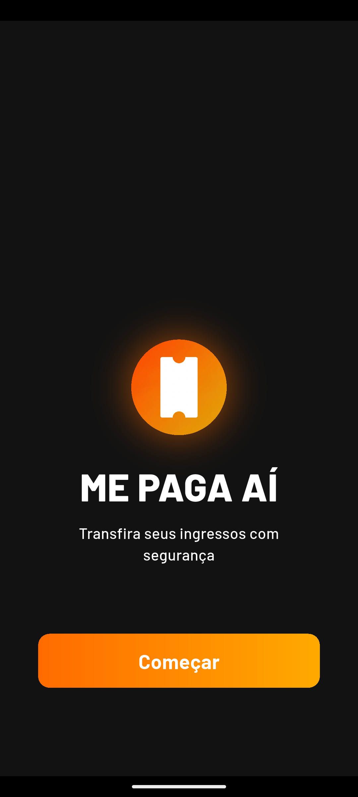
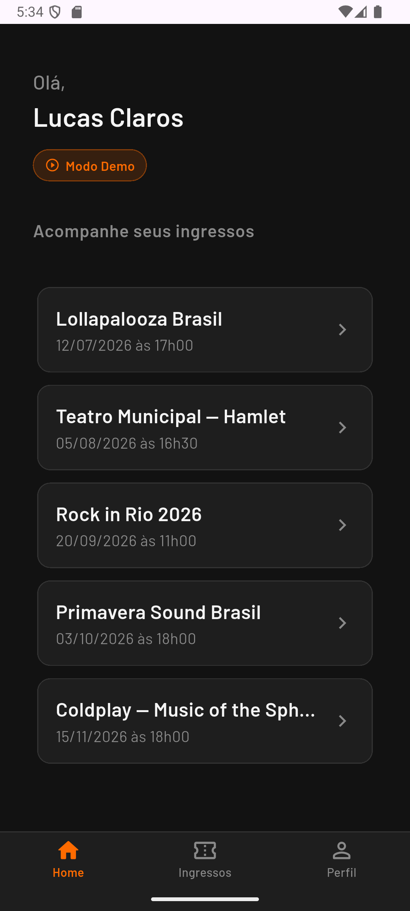
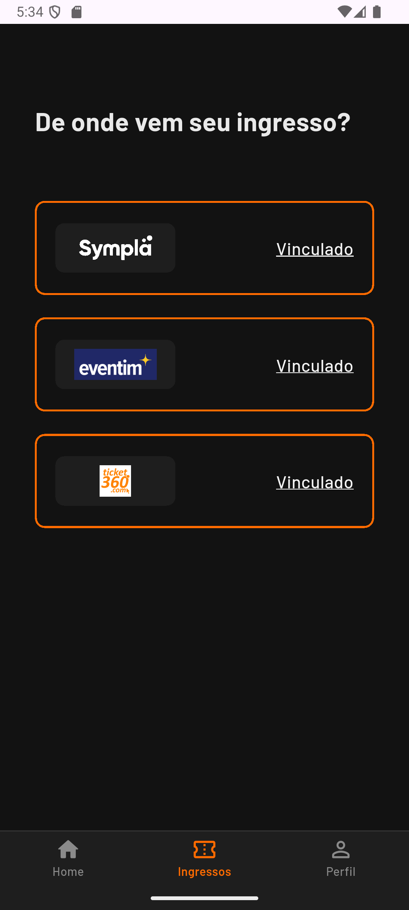
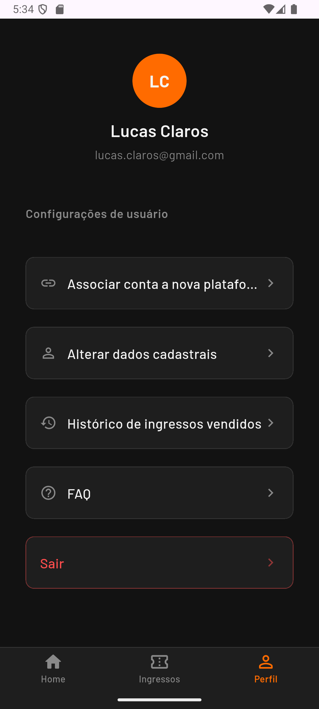

# MePagaAí — Mobile

> Marketplace P2P para revenda segura de ingressos

App Flutter para compra e venda de ingressos entre usuários, com integração a plataformas de bilheteria, verificação por OTP, pagamento via Pix e fluxo completo de transferência segura.

---

## Screenshots

| Welcome | Home | Venda |
|---------|------|-------|
|  |  |  |

| Plataformas | Perfil |
|-------------|--------|
|  |  |

---

## Funcionalidades

- **Autenticação completa** — cadastro, login, verificação por OTP via e-mail
- **Listagem de ingressos** com paginação infinita (scroll)
- **Fluxo de venda** — vendedor cadastra ingresso, define preço e gera link único de compra
- **Fluxo de compra** — comprador acessa link, valida e-mail, realiza pagamento via Pix
- **Integração com plataformas de bilheteria** (Sympla, Eventim, Ticket360) — vinculação e validação de conta via OTP
- **Registro de chave Pix** para recebimento
- **Countdown de expiração** de oferta de ingresso
- **Onboarding** para novos usuários

---

## Stack

| Camada | Tecnologia |
|--------|------------|
| Framework | Flutter 3.x / Dart |
| State Management | flutter_bloc (BLoC pattern) |
| Injeção de Dependências | Provider |
| Navegação | go_router |
| HTTP Client | Dio + interceptors customizados |
| Storage Seguro | flutter_secure_storage (JWT) |
| Serialização | json_serializable + json_annotation |
| UI | flutter_screenutil, shimmer, cached_network_image |

---

## Arquitetura

Clean Architecture com o domínio isolado em um pacote Dart separado (`domain/`), sem dependência de Flutter ou de qualquer framework externo.

```
┌─────────────────────────────────────┐
│          Presentation               │
│   BLoC · Views · Widgets · Router   │
├─────────────────────────────────────┤
│             Data                    │
│  Repositories · DataSources · Dio   │
│  RemoteModels · Mappers · Cache     │
├─────────────────────────────────────┤
│       Domain  (pacote separado)     │
│   UseCases · Models · Interfaces    │
└─────────────────────────────────────┘
```

**Fluxo de dados:**

```
BLoC → UseCase → Repository Interface
                        ↓
               [Data Layer implementa]
                        ↓
             RemoteDataSource (Dio) → API
             CacheDataSource (SecureStorage)
```

**Camada Domain** — pacote Dart puro em `/domain`, zero dependência de Flutter:
- Modelos: `User`, `Ticket`, `Party`, `Platform`, `PaymentCharge`
- Interfaces: `AuthRepositoryInterface`, `UserRepositoryInterface`
- +15 use cases: `UserLoginUC`, `OTPVerificationUC`, `GetUserTicketsUC`, `PlatformRegisterUC`, `PixRegisterUC`...

**Interceptors Dio:**
- `AuthInterceptor` — injeta JWT em cada request a partir do cache seguro
- `MockInterceptor` — simula responses da API via JSON local para dev sem backend

---

## Estrutura

```
lib/
├── common/            # DI (Provider) e GoRouter config
├── config/            # Feature flags (kMockApiCalls)
├── data/
│   ├── cache/         # SecureStorage data source
│   ├── mappers/       # RM → DM → VM conversions
│   ├── models/        # RemoteModels, ViewModels, MemoryModels
│   ├── remote/        # DataSources, interceptors, URL builder
│   └── repositories/  # Implementações das interfaces do domain
└── presentation/
    ├── auth/          # Login, Register, OTP
    ├── home/          # Dashboard com paginação infinita, Profile
    ├── logistics/     # Fluxos de compra e venda
    ├── onboarding/
    ├── registration/  # Cadastro de plataforma e Pix
    └── welcome/

domain/                # Pacote Dart separado — negócio puro
├── models/
├── repositories/      # Contratos (interfaces)
└── use_cases/
```

---

## Como rodar

```bash
flutter pub get
dart run build_runner build --delete-conflicting-outputs
flutter run
```

`kMockApiCalls = true` por padrão em `lib/config/app_config.dart` — o app roda com dados mockados sem precisar do backend.

---

## Contexto

MVP de marketplace P2P de ingressos desenvolvido com amigos de faculdade. O mobile foi desenvolvido por mim do zero — arquitetura, todas as features, integração com as APIs externas e configuração Firebase. O backend REST foi desenvolvido em paralelo por outro membro da equipe em Kotlin/Spring Boot.
